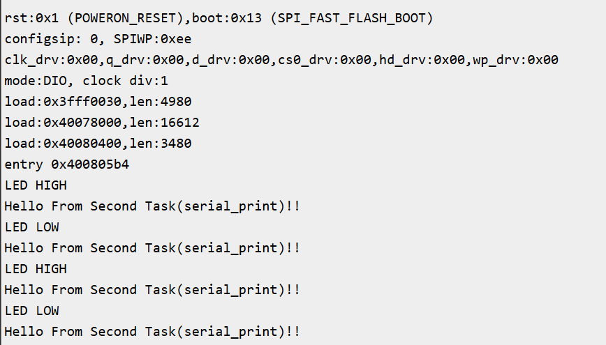

# FreeRTOS Exercise 2: Two Tasks (LED Blink + Serial output)

## Introduction
This example demonstrates two task creation in FreeRTOS. The 1st task blinks an LED connected to pin 16 and 2nd task give an output on the serial console on the ESP32‑WROOM‑DA module.

## Commands Used
- **xTaskCreate()** → Creates a new task and adds it to the scheduler.
- **vTaskDelay()** → Suspends the task for a given time, allowing other tasks to run.
- **pdMS_TO_TICKS()** → Converts milliseconds to RTOS ticks for accurate timing.

## Hardware/Software Requirements
- ESP32‑WROOM‑DA Module
- Arduino IDE
- FreeRTOS (ESP32 Arduino core)
- Serial Monitor

## Expected Output
```
LED High
Hello From Second Task(serial_print)!!
LED Low
Hello From Second Task(serial_print)!!
```


## Code
```ino
const int led_pin = 16;
TaskHandle_t taskAHandle;
TaskHandle_t taskBHandle;

void led_task(void *pvParameters)
{
  pinMode(led_pin, OUTPUT);
  while(1)
  {
    digitalWrite(led_pin, HIGH);
    Serial.println("LED HIGH");
    vTaskDelay(pdMS_TO_TICKS(500));

    digitalWrite(led_pin, LOW);
    Serial.println("LED LOW");
    vTaskDelay(pdMS_TO_TICKS(500));
  }
}

void serial_print(void *pvParameters)
{
  while(1)
  {
    Serial.println("Hello From Second Task(serial_print)!!");
    vTaskDelay(pdMS_TO_TICKS(500));
  }
}

void setup() {
  Serial.begin(115200);

  if ( xTaskCreate(led_task, "Task 1", 1024, NULL, 1, &taskAHandle) != pdPASS )
  {
    Serial.println("Failed to create LED Task");
  }
  if ( xTaskCreate(serial_print, "Task 2", 1024, NULL, 1, &taskBHandle) != pdPASS )
  {
    Serial.println("Failed to create serial_print Task");
  }
}

void loop() {
// Empty: FreeRTOS scheduler runs tasks
}
```
## Learning Outcomes
- Learned how to create multiple tasks with FreeRTOS.
- Learnt about xTaskCreate() priorities only matter when tasks are ready at the same time.