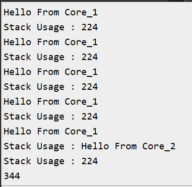

# FreeRTOS Exercise 3: Dual Core Tasks + Stack Monitoring

## Introduction
This example demonstrates creating two tasks pinned to different cores on the ESP32‑WROOM‑DA module. Each task prints a message and reports its stack usage using `uxTaskGetStackHighWaterMark()`.

## Commands Used
- **xTaskCreatePinnedToCore()** → Creates a new task and pin it to a specified core.
- **vTaskDelay()** → Suspends the task for a given time, allowing other tasks to run.
- **pdMS_TO_TICKS()** → Converts milliseconds to RTOS ticks for accurate timing.
- **uxTaskGetStackHighWaterMark** → Return the minimum space available in the stack.

## Hardware/Software Requirements
- ESP32‑WROOM‑DA Module
- Arduino IDE
- FreeRTOS (ESP32 Arduino core)
- Serial Monitor

## Expected Output
Example Serial Monitor output (may interleave due to concurrent access):
```
Hello From Core_1
Stack Usage : 224
Hello From Core_1
Stack Usage : 224
Hello From Core_1
Stack Usage : 224
Hello From Core_1
Stack Usage : 224
Hello From Core_1
Stack Usage : Hello From Core_2
Stack Usage : 224
344
```


## Code
```ino
TaskHandle_t taskAHandle;
TaskHandle_t taskBHandle;

void Core_1(void *pvParameters)
{
  while(1)
  {
    Serial.println("Hello From Core_1");
    Serial.print("Stack Usage : "); Serial.println(uxTaskGetStackHighWaterMark(NULL));
    vTaskDelay(pdMS_TO_TICKS(200));
  }
}

void Core_2(void *pvParameters)
{
  while(1)
  {
    Serial.println("Hello From Core_2");
    Serial.print("Stack Usage : "); Serial.println(uxTaskGetStackHighWaterMark(NULL));
    vTaskDelay(pdMS_TO_TICKS(1000));
  }
}

void setup() {
  Serial.begin(115200);

  if ( xTaskCreatePinnedToCore(Core_1, "Core_1", 1024, NULL, 1, &taskAHandle, 0) != pdPASS )
  {
    Serial.println("Failed to create Core_1 Task");
  }
  if ( xTaskCreatePinnedToCore(Core_2, "Core_2", 1024, NULL, 3, &taskBHandle, 1) != pdPASS )
  {
    Serial.println("Failed to create Core_2 Task");
  }
}

void loop() {
// Empty: FreeRTOS scheduler runs tasks
}

```
## Note
When multiple tasks use Serial, the output may overlap. This can be solved using a Mutex or a dedicated logging task.

## Learning Outcomes
- Learned about tasks pinned to specific cores.
- Learned how to use `uxTaskGetStackHighWaterMark()` to measure free stack space.
- Understood that shared resources (like Serial) need synchronization to avoid conflicts.

## Next Steps
- Assign different stack sizes to observe how free stack space changes.
- Add a Mutex to protect Serial output and avoid printing conflicts.
- Create a separate logging task that uses a queue to collect messages and prints them sequentially.