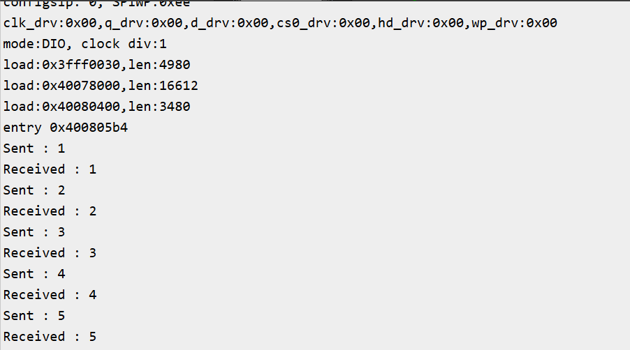

# FreeRTOS Exercise 4: Queue Basics

## Introduction
This exercise introduces **inter‑task communication** in FreeRTOS using **queues**.  
Two tasks (Sender and Receiver) communicate by passing simple integer values through a queue.  
This demonstrates how tasks can safely exchange data without using global variables.

---

## FreeRTOS Queue Functions Used
- **QueueHandle_t xQueueCreate( UBaseType_t uxQueueLength, UBaseType_t uxItemSize )**  
  Creates a queue with specified length and item size. Returns a handle to the created queue.

- **BaseType_t xQueueSend( QueueHandle_t xQueue, const void * pvItemToQueue, TickType_t xTicksToWait )**  
  Sends an item to the back of the queue. Blocks for `xTicksToWait` if the queue is full. Returns `pdPASS` if successful.

- **BaseType_t xQueueReceive( QueueHandle_t xQueue, void * pvBuffer, TickType_t xTicksToWait )**  
  Receives an item from the queue. Blocks for `xTicksToWait` if the queue is empty. Returns `pdPASS` if successful.

## Hardware/Software Requirements
- ESP32‑WROOM‑DA Module
- Arduino IDE
- FreeRTOS (ESP32 Arduino core)
- Serial Monitor

## Expected Output
```
Sent : 1
Received : 1
Sent : 2
Received : 2
Sent : 3
Received : 3
```


## Code
```ino
QueueHandle_t queue1;

void senderTask(void *pvParameters)
{
  int count = 0;
  while(1)
  {
    count++;
    if ( xQueueSend(queue1, &count, portMAX_DELAY) == pdPASS )
    {
      Serial.print("Sent : ");
      Serial.println(count);
    }
    vTaskDelay(pdMS_TO_TICKS(1000));
  }
}

void receiverTask(void *pvParameters)
{
  int received = 0;
  while(1)
  {
    if ( xQueueReceive(queue1, &received, portMAX_DELAY) == pdPASS )
    {
      Serial.print("Received : ");
      Serial.println(received);
    }
  }
}

void setup() {
  Serial.begin(115200);

  // Create a queue to hold 5 integer values
  queue1 = xQueueCreate(5, sizeof(int));

  if (queue1 == NULL)
  {
    Serial.println("Failed to create Queue..");
    while(1);
  }

  xTaskCreate(senderTask, "Sender", 1024, NULL, 1, NULL);
  xTaskCreate(receiverTask, "Receiver", 1024, NULL, 1, NULL);
}

void loop() {
  // Empty: FreeRTOS scheduler runs tasks
}
```

## Learning Outcomes
- Learned how to create and use queues in FreeRTOS.
- Understood how to send and receive simple integer data between tasks.
- Observed safe communication without global variables.
- Recognized how queues act as mailboxes for inter‑task communication.

## Next Steps
- Add multiple producers (e.g., different sensors) sending data into the same queue.
- Experiment with different queue lengths and observe behavior when the queue is full.
- Use timeouts in xQueueSend and xQueueReceive to handle blocking conditions.