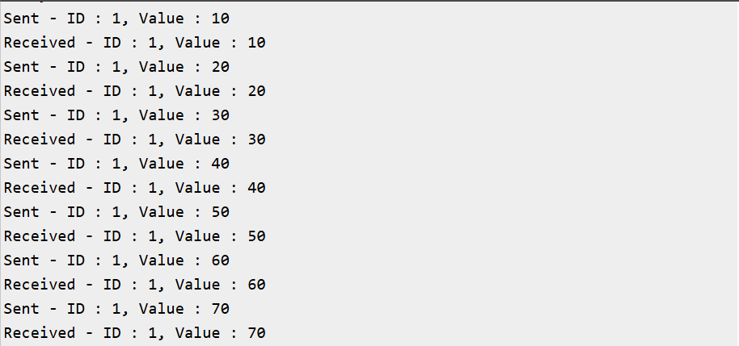

# FreeRTOS Exercise 5: Queue with Structs

## Introduction
This exercise extends the concept of **inter‑task communication** in FreeRTOS by passing **structured data** through a queue.  
Instead of sending simple integers, the Producer task generates a `sensor_t` struct containing an ID and a value, and the Consumer task receives and prints it.  
This demonstrates how FreeRTOS queues can handle complex data types, making them suitable for real embedded applications like sensor data logging.

---

## FreeRTOS Queue Functions Used
- **QueueHandle_t xQueueCreate( UBaseType_t uxQueueLength, UBaseType_t uxItemSize )**  
  Creates a queue with specified length and item size. Returns a handle to the created queue.

- **BaseType_t xQueueSend( QueueHandle_t xQueue, const void * pvItemToQueue, TickType_t xTicksToWait )**  
  Sends an item to the back of the queue. Blocks for `xTicksToWait` if the queue is full. Returns `pdPASS` if successful.

- **BaseType_t xQueueReceive( QueueHandle_t xQueue, void * pvBuffer, TickType_t xTicksToWait )**  
  Receives an item from the queue. Blocks for `xTicksToWait` if the queue is empty. Returns `pdPASS` if successful.

## Hardware/Software Requirements
- ESP32‑WROOM‑DA Module
- Arduino IDE
- FreeRTOS (ESP32 Arduino core)
- Serial Monitor

## Expected Output
```
Sent - ID : 1, Value : 10
Received - ID : 1, Value : 10
Sent - ID : 1, Value : 20
Received - ID : 1, Value : 20
Sent - ID : 1, Value : 30
Received - ID : 1, Value : 30
```


## Code
```ino
QueueHandle_t queue1;

typedef struct 
{
  int ID;
  int value;
} sensor_t;

char buffer[64];

// Producer Task: generates sensor data and sends to queue
void producerTask(void *pvParameters) 
{
  sensor_t producerData;
  producerData.ID = 1;
  producerData.value = 0;

  while (1) 
  {
    producerData.value += 10;
    if (xQueueSend(queue1, &producerData, portMAX_DELAY) == pdPASS) 
    {
      snprintf(buffer, sizeof(buffer), "Sent - ID : %d, Value : %d", producerData.ID, producerData.value);
      Serial.println(buffer);
    }
    vTaskDelay(pdMS_TO_TICKS(500));
  }
}

// Consumer Task: receives sensor data from queue and prints
void consumerTask(void *pvParameters) 
{
  sensor_t consumerData;
  while (1) 
  {
    if (xQueueReceive(queue1, &consumerData, portMAX_DELAY) == pdPASS) 
    {
      snprintf(buffer, sizeof(buffer), "Received - ID : %d, Value : %d", consumerData.ID, consumerData.value);
      Serial.println(buffer);
    }
  }
}

void setup() {
  Serial.begin(115200);

  // Create a queue to hold 5 sensor_t items
  queue1 = xQueueCreate(5, sizeof(sensor_t));
  if (queue1 == NULL) {
    Serial.println("Failed to create Queue..");
    while (1);
  }

  xTaskCreate(producerTask, "Producer", 2048, NULL, 1, NULL);
  xTaskCreate(consumerTask, "Consumer", 2048, NULL, 1, NULL);
}

void loop() {
  // Empty: FreeRTOS scheduler runs tasks
}
```

## Learning Outcomes
- Learned how to send and receive structured data between tasks using queues.
- Understood how queues can handle complex data types beyond simple integers.
- Observed safe communication without global variables.
- Recognized how this approach can be applied to real scenarios like sensor data logging or message passing.