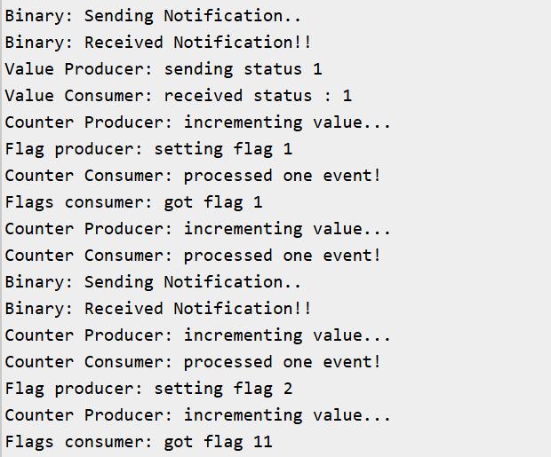

# FreeRTOS Exercise 7: Advanced Task Notifications (Values, Counters, Flags)

## Introduction
This exercise expands on the basics of **Task Notifications** introduced in Exercise 6.  
Here, we explore the different notification APIs and actions available in FreeRTOS, showing how they can be used for:
- Simple signaling (like a binary semaphore)
- Counting events (like a counting semaphore)
- Passing integer values directly
- Setting flags (like lightweight event groups)

---

## FreeRTOS Notification Functions Used
- **BaseType_t xTaskNotify( TaskHandle_t xTask, uint32_t ulValue, eNotifyAction eAction )**  
  Sends a notification with a value and an action.  
  - `eSetValueWithOverwrite` → overwrite the current value.  
  - `eSetValueWithoutOverwrite` → only set if no notification is pending.  
  - `eIncrement` → increment the notification counter.  
  - `eSetBits` → set specific bits in the notification value.

- **BaseType_t xTaskNotifyWait( uint32_t ulBitsToClearOnEntry, uint32_t ulBitsToClearOnExit, uint32_t *pulNotificationValue, TickType_t xTicksToWait )**  
  Waits for a notification and retrieves its value or flags.

- **BaseType_t xTaskNotifyGive( TaskHandle_t xTask )**  
  Sends a simple signal to a task (increments its internal counter).

- **uint32_t ulTaskNotifyTake( BaseType_t xClearCountOnExit, TickType_t xTicksToWait )**  
  Waits for a signal and consumes the notification count.

---

## Hardware/Software Requirements
- ESP32‑WROOM‑DA Module  
- Arduino IDE  
- FreeRTOS (ESP32 Arduino core)  
- Serial Monitor  

---

## Expected Output
Example Serial Monitor output (simplified):
```
Binary Producer: notifying...
Binary Consumer: received signal!
Value Producer: sending status 1
Value Consumer: got status 1
Counter Producer: incrementing...
Counter Consumer: processed one event!
Flags Producer: setting bit 10
Flags Consumer: got flags 10
```


---

## Code
```ino
TaskHandle_t taskHandleBinary;
TaskHandle_t taskHandleValue;
TaskHandle_t taskHandleCounter;
TaskHandle_t taskHandleFlag;

/* Producer for binary notification */
void producerBinary(void *pvParameters)
{
  while(1)
  {
    Serial.println("Binary: Sending Notification..");
    xTaskNotifyGive(taskHandleBinary);
    vTaskDelay(pdMS_TO_TICKS(1000));
  }
}

/* Consumer for binary notification */
void consumerBinary(void *pvParameters)
{
  while(1)
  {
    ulTaskNotifyTake(pdTRUE, portMAX_DELAY);
    Serial.println("Binary: Received Notification!!");
  }
}

/*------------------------------------------------------------*/

/* Producer for overwrite value */
void producerValue(void *pvParameters)
{
  uint32_t status = 0;
  while(1)
  {
    status = ( status + 1 ) % 3;
    Serial.print("Value Producer: sending status ");
    Serial.println(status);
    xTaskNotify(taskHandleValue, status, eSetValueWithOverwrite);
    vTaskDelay(pdMS_TO_TICKS(2000));
  }
}

/* Consumer for overwrite value */
void consumerValue(void *pvParameters)
{
  uint32_t received;
  while(1)
  {
    if ( xTaskNotifyWait(0, 0, &received, portMAX_DELAY ) == pdTRUE )
    {
      Serial.print("Value Consumer: received status : ");
      Serial.println(received);
    }
  }
}

/*------------------------------------------------------------*/

/* Producer for increment counter */
void producerCounter(void *pvParameters)
{
  while(1)
  {
    Serial.println("Counter Producer: incrementing value...");
    xTaskNotify(taskHandleCounter, 0, eIncrement);
    vTaskDelay(pdMS_TO_TICKS(500));
  }
}

/* Consumer for increment counter */
void consumerCounter(void *pvParameters)
{
  while(1)
  {
    ulTaskNotifyTake(pdTRUE, portMAX_DELAY);
    Serial.println("Counter Consumer: processed one event!");
  }
}

/*-----------------------------------------------------------*/

/* Producer for flags */
void producerFlag(void *pvParameters)
{
  uint32_t flag = 1;
  while(1)
  {
    Serial.print("Flag producer: setting flag ");
    Serial.println(flag);
    xTaskNotify(taskHandleFlag, flag, eSetBits);
    flag <<= 1;
    /* Resets the flag to 1 after cycle through 1,2,4 */
    if ( flag > 0x04 ) flag = 1; 
    vTaskDelay(pdMS_TO_TICKS(1500));
  }
}

/* Consumer for flags */
void consumerFlag(void *pvParameters)
{
  uint32_t flags;
  while(1)
  {
    if ( xTaskNotifyWait(0, 0, &flags, portMAX_DELAY) == pdPASS )
    {
      Serial.print("Flags consumer: got flag ");
      Serial.println(flags);
    }
  }
}

/*-----------------------------------------------------------*/

void setup() 
{
  Serial.begin(115200);

  xTaskCreate(consumerBinary, "BinaryConsumer", 2048, NULL, 1, &taskHandleBinary);
  xTaskCreate(producerBinary, "BinaryProducer", 2048, NULL, 1, NULL);

  xTaskCreate(consumerValue, "ValueConsumer", 2048, NULL, 1, &taskHandleValue);
  xTaskCreate(producerValue, "ValueProducer", 2048, NULL, 1, NULL);

  xTaskCreate(consumerCounter, "CounterConsumer", 2048, NULL, 1, &taskHandleCounter);
  xTaskCreate(producerCounter, "CounterProducer", 2048, NULL, 1, NULL);

  xTaskCreate(consumerFlag, "FlagsConsumer", 2048, NULL, 1, &taskHandleFlag);
  xTaskCreate(producerFlag, "FlagsProducer", 2048, NULL, 1, NULL);
}

void loop() 
{
  /* Empty: FreeRTOS scheduler runs tasks */
}

```

---

## Learning Outcomes
- Learned how to use task notifications for multiple purposes:
    - Binary signaling (like a binary semaphore).
    - Counting events (like a counting semaphore).
    - Passing integer values directly between tasks.
    - Setting flags (like lightweight event groups).
- Understood that notifications are lighter and faster than queues, but limited to one integer per task.
---
