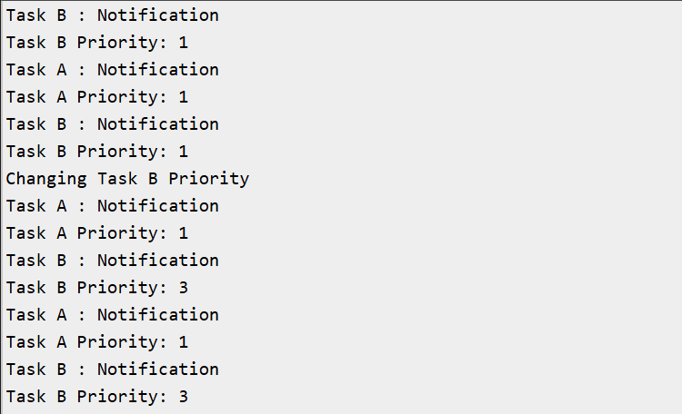

# FreeRTOS Exercise 8: Mutex with Dynamic Task Priority

## Introduction
This exercise demonstrates two important FreeRTOS concepts working together:
1. **Mutex (Mutual Exclusion):** Ensures safe access to shared resources (here, the Serial interface).
2. **Dynamic Task Priority:** Shows how a task’s priority can be changed at runtime based on conditions.

By combining these, you learn how to synchronize tasks while also controlling their scheduling behavior dynamically.

---

## FreeRTOS Functions Used
- **QueueHandle_t xSemaphoreCreateMutex()**  
  Creates a mutex object for resource protection.

- **BaseType_t xSemaphoreTake( SemaphoreHandle_t xSemaphore, TickType_t xTicksToWait )**  
  Locks the mutex. Blocks if another task already holds it.

- **BaseType_t xSemaphoreGive( SemaphoreHandle_t xSemaphore )**  
  Unlocks the mutex, allowing other tasks to use the resource.

- **void vTaskPrioritySet( TaskHandle_t xTask, UBaseType_t uxNewPriority )**  
  Dynamically changes the priority of a task.

- **UBaseType_t uxTaskPriorityGet( TaskHandle_t xTask )**  
  Retrieves the current priority of a task.

---

## Hardware/Software Requirements
- ESP32‑WROOM‑DA Module  
- Arduino IDE  
- FreeRTOS (ESP32 Arduino core)  
- Serial Monitor  

---

## Expected Output
Example Serial Monitor output:
```
Task A : Notification
Task A Priority: 1
Task B : Notification
Task B Priority: 1
...
Changing Task B Priority
Task B : Notification
Task B Priority: 3
```


---

## Code
```ino
QueueHandle_t serialMutex;
TaskHandle_t taskAHandle;
TaskHandle_t taskBHandle;

void TaskA(void *pvParameters)
{
  while(1)
  {
    static int counter = 0;
    if ( xSemaphoreTake(serialMutex, portMAX_DELAY) )
    {
      Serial.println("Task A : Notification");
      Serial.print("Task A Priority: ");
      Serial.println(uxTaskPriorityGet(taskAHandle));
      xSemaphoreGive(serialMutex);
    }
    vTaskDelay(pdMS_TO_TICKS(1000));

    counter++;
    if (counter == 5)
    {
      Serial.println("Changing Task B Priority");
      vTaskPrioritySet(taskBHandle, 3); // Raise Task B priority
    }
  }
}

void TaskB(void *pvParameters)
{
  while(1)
  {
    if ( xSemaphoreTake(serialMutex, portMAX_DELAY) )
    {
      Serial.println("Task B : Notification");
      Serial.print("Task B Priority: ");
      Serial.println(uxTaskPriorityGet(taskBHandle));
      xSemaphoreGive(serialMutex);
    }
    vTaskDelay(pdMS_TO_TICKS(1000));
  }
}

void setup() {
  Serial.begin(115200);

  serialMutex = xSemaphoreCreateMutex();
  if ( serialMutex == NULL )
  {
    Serial.println("Failed : Mutex Creation");
    while(1);
  }

  xTaskCreate(TaskA, "Task A", 2048, NULL, 1, &taskAHandle);
  xTaskCreate(TaskB, "Task B", 2048, NULL, 1, &taskBHandle);
}

void loop() {
  // Empty: FreeRTOS scheduler runs tasks
}
```

---

## Learning Outcomes
- Learned how to **protect shared resources** (Serial) using a mutex.  
- Understood how to **dynamically change task priorities** at runtime.  
- Observed how priority changes affect task scheduling and execution order.  
- Recognized that mutexes and dynamic priorities together provide fine‑grained control over both **resource access** and **task scheduling**.

---

## Next Steps
- Experiment with lowering Task B’s priority back after some time to see both directions of dynamic control.  
- Try different delays for Task A and Task B to observe how scheduling changes.  
- Extend this concept to a real application, e.g., **sensor logging with priority boost when thresholds are crossed**.  

---